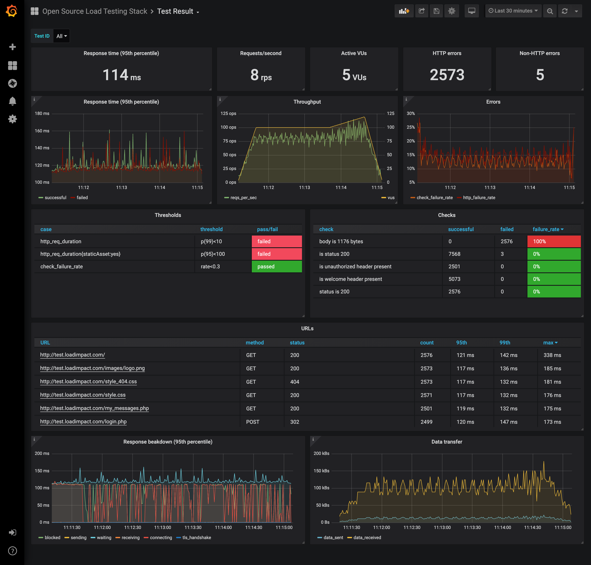

# xk6-output-timescaledb

`xk6-output-timescaledb` is a [k6 extension](https://k6.io/docs/extensions/) to send k6 metrics to TimescaleDB in a predefined schema.

# Install

You will need [go](https://golang.org/)

```bash

# Install xk6
go install go.k6.io/xk6/cmd/xk6@latest

# Build the k6 binary
xk6 build --with github.com/grafana/xk6-output-timescaledb

... [INFO] Build environment ready
... [INFO] Building k6
... [INFO] Build complete: ./k6
```
You will have a `k6` binary in the current directory.

**Using Docker**

This [Dockerfile](./Dockerfile) builds a docker image with the k6 binary.


# Configuration


First, find the [postgres connection string](https://www.postgresql.org/docs/current/libpq-connect.html#LIBPQ-CONNSTRING) of the TimescaleDB instance.

To run a k6 test and send the k6 metrics to TimescaleDB, use the `k6 run` command and set the [k6 output option](https://k6.io/docs/using-k6/options/#results-output) as `timescaledb=YOUR_POSTGRES_CONNECTION_STRING`. For example:


```bash
k6 run -o timescaledb=postgresql://k6:k6@timescaledb:5432/k6 script.js
```

or use an environment variable:

```bash
K6_OUT=timescaledb=postgresql://k6:k6@timescaledb:5432/k6 k6 run script.js
```

## Options

The `xk6-output-timescaledb` extension supports the additional options:

|                      |                                                                                                   |
| ------------------------- | ------------------------------------------------------------------------------------------------------ |
| `K6_TIMESCALEDB_PUSH_INTERVAL`          | Define how often metrics are sent to TimescaleDB.  The default value is `1s` (1 second). |


# Docker-compose

This repo includes a [docker-compose.yml](./docker-compose.yml) file that starts timescaledb, grafana and k6. This is just a quick to setup to show the usage, for real use case you might want to deploy outside of docker, use volumes and probably update versions.

Clone the repo to get get started and follow these steps: 

1. Build the k6 binary following the [installation instructions above](#install).

2. Put your k6 scripts in the `scripts` directory.

3. Start the docker compose environments.
	```shell
	docker-compose up -d
	```
4. You can now run the k6 script and send metrics to the TimescaleDB container started on the previous step.
	```shell
	docker-compose run k6 -<scripts/http_2.js --tag testid=<someid>
	```

	> Note the difference [running k6 tests with Docker](https://k6.io/docs/getting-started/running-k6/).

	You'll also need to [tag your test runs](https://k6.io/docs/using-k6/tags-and-groups/#test-wide-tags) with a `testid` (the value can be whatever you want to use as a unique identifier for test runs like a date string, numeric ID etc.). This tag is what enables the pre-built Grafana dashboards to segment the result data into discrete test runs.


5. Visit http://localhost:3000 to view results in Grafana.

## Dashboards

The docker-compose setup comes with two pre-built dashboards. One for listing the discrete test runs as a list, and the other for visualizing the results of a specific test run.

### Test list dashboard


### Test result dashboard

